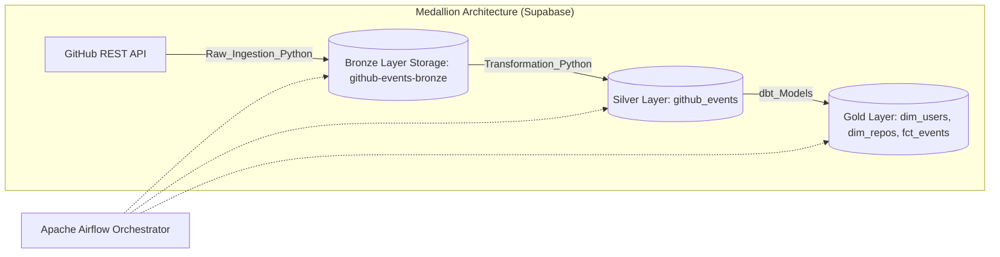
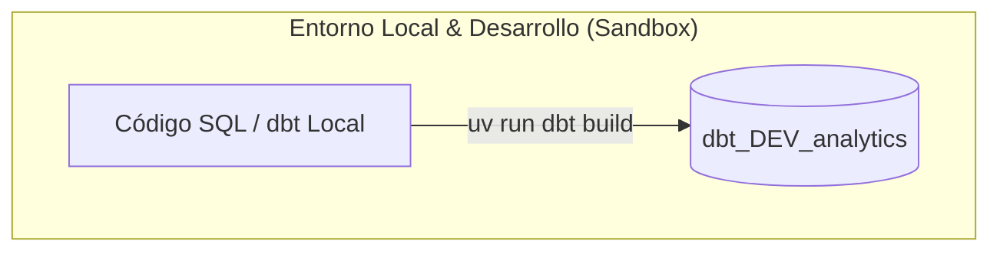
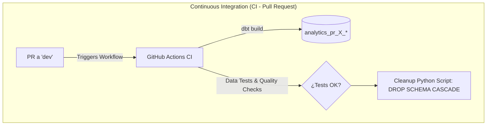
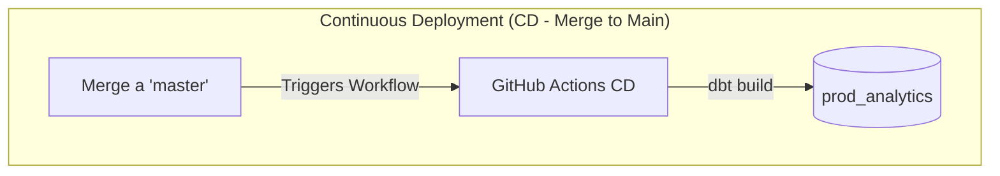

# GitHub Analytics - Modern Data Stack Pipeline

Pipeline de *Analytics Engineering* end-to-end diseñado bajo la arquitectura Medallion y herramientas del Modern Data Stack (MDS). Realiza el consumo de eventos semi-estructurados de la API de GitHub mediante **Python** y construye un Data Lakehouse/Warehouse en **Supabase (PostgreSQL)** estructurado en capas (*Bronze*, *Silver* y *Gold*), realizando la transformación de la capa analítica con **dbt**. El pipeline completo se orquesta con **Apache Airflow**, usando **GitHub Actions** para la automatización  **Slim CI / CD**.

## Arquitectura

### 1. Diagrama End-to-End (Medallion)

### 2. Diagrama CI/CD

## Tech Stack

| Área | Tecnologías Utilizadas |
| :--- | :--- |
| **Ingestion** | Python 3.11+, REST APIs |
| **Orchestration** | Apache Airflow |
| **Data Architecture** | Medallion Architecture (Bronze ➔ Silver ➔ Gold) |
| **Data Transformation** | dbt-core (v1.8+), Jinja, dbt_expectations |
| **Data Warehouse** | Supabase (PostgreSQL) |
| **CI-CD & Automation** | GitHub Actions (Slim CI / CD Workflows) |
| **Environment & Tooling** | `uv` , `psycopg2` |
| **Version Control** | Git / GitHub (Git Flow: `feature/*` ➔ `dev` ➔ `main`) |

## Características principales
* **Entorno Determinista con `uv`:** Uso de `uv` como gestor de paquetes de Python garantizando builds reproducibles tanto en local como en los runners de GitHub Actions (`uv run dbt deps` / `uv run dbt build`).
* **Arquitectura Medallion en Supabase:**
  * **Bronze (`storage`):** Ingesta cruda de eventos semi-estructurados en JSON desde la API de GitHub mediante Python.
  * **Silver (`raw`):** Limpieza, de-duplicación, casting de tipos y filtrado inicial procesado con Python.
  * **Gold (`analytics`):** Tablas de hechos incrementales (`fct_github_events`) y dimensiones (`dim_github_users`, `dim_github_repositories`) modeladas con dbt.
* **Orquestación Containerizada con Docker & Airflow:** Programación modular (cada 5 minutos) de las tareas de extracción, carga e invocación de transformaciones (dbt) mediante Apache Airflow desplegado localmente en contenedores Docker (`Docker Compose`).
* **Modelos Incrementales en Fact Table:** Configuración de `fct_github_events` como tabla incremental para optimizar los tiempos de ejecución y minimizar costes de cómputo al procesar únicamente los eventos nuevos.
* **Calidad de Datos Automatizada:** Más de 14 data tests integrados (`not_null`, `unique`, `relationships` y reglas de negocio validadas con `dbt_expectations`).
* **Slim CI con Esquemas Efímeros & Autocleanup:** Generación dinámica de esquemas aislados por Pull Request (ej. `analytics_pr_9_%`). Incluye un script que limpia los esquemas al finalizar el CI.
* **Despliegue Continuo (CD) & Custom Schemas:** Macros personalizadas en dbt para derivar automáticamente esquemas por entorno y publicar cambios directamente a producción (`prod_src` y `prod_analytics`) tras el merge en `main`.

* **Seguridad y Gestión de Credenciales:** Aislamiento de variables sensibles mediante archivos `.env` en desarrollo local y la inyección segura de credenciales (`SUPABASE_DB_*`) usando **GitHub Repository Secrets** en los flujos de CI/CD.

## Resultados

### 1. Almacenamiento

#### - Capa Bronze

#### - Capa Silver

#### - Gold

#### - Gold --- *fct_github_events*

#### - Gold --- *dim_github_users*

#### - Gold --- *dim_github_repositories*

### 2. Orquestación

#### - DAG

#### - Esquema

#### - Ejecución

